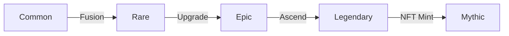

# Competitive Strategy & Implementation Plan

## 1. Core Game Loop Enhancement

### Priority: Strategic Grid Combat

- **Visual Feedback System**
  - Highlight attack ranges and threat zones
  - Show movement paths and attack vectors
  - Visual indicators for area-of-effect abilities

### Tactical Tutorial Design

- **Phased Learning**
  - Basic movement and positioning
  - Faction-specific tactics
  - Advanced grid manipulation
- **AI Demonstrations**
  - Showcase optimal positioning
  - Demonstrate combo setups
  - Teach counter-play strategies

## 2. Onboarding & Accessibility

### Progressive Complexity

1. **Tutorial Flow**
   - Basic card play (Turn 1-3)
   - Grid positioning (Turn 4-6)
   - Faction mechanics (Turn 7+)

### UI/UX Improvements

- **Contextual Help**
  - Tooltips for advanced mechanics
  - Interactive glossary
  - Visual hierarchy for key information

## 3. NFT Value Proposition

### Upgrade Visualization

### Ownership Benefits

- **Visual Indicators**
  - Unique card borders
  - Animated effects
  - Customization options
- **Progression Tracking**
  - Lifetime stats
  - Upgrade history
  - Tournament achievements

## 4. Content Strategy

### Faction Updates

- **Monthly Themes**
  - Faction spotlights
  - New Crisis events
  - Limited-time artifacts

### Community Engagement

- **Tournament Structure**
  - Weekly faction wars
  - Monthly championships
  - Special rules events

## Implementation Roadmap

### Phase 1: Core Combat (Weeks 1-4)

- [ ] Grid combat prototype
- [ ] Basic AI behavior
- [ ] Core UI/UX implementation

### Phase 2: Progression (Weeks 5-8)

- [ ] NFT integration
- [ ] Upgrade systems
- [ ] Collection interface

### Phase 3: Polish (Weeks 9-12)

- [ ] Tutorial systems
- [ ] Visual feedback
- [ ] Performance optimization

## Success Metrics

### Engagement

- Session length
- Tutorial completion
- Daily active users

### Retention

- Day 7/30/90
- Faction diversity
- Deck experimentation

### Monetization

- NFT conversion
- Marketplace activity
- Premium features

---
*Document Version: 1.0.0*  
*Last Updated: 2025-07-31*
