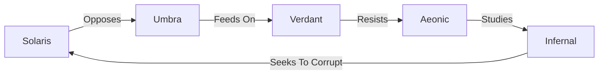

# Crisis Unleashed Faction System

## Core Factions

### 1. Solaris Order

- **Theme**: Light, law, judgment, ascension
- **Visual**: Golden-white, armor, sigils, divine rays
- **Key Mechanics**: Buffs, barriers, radiant damage
- **Signature Keywords**: Bless, Illuminate, Fortify
- **Hero Example**: Solariem, Flame of Order - Grants allies immunity from first debuff

### 2. Umbra Wretches

- **Theme**: Curses, betrayal, darkness, madness
- **Visual**: Purple-black mist, twisted limbs, shadow creatures
- **Key Mechanics**: Steal, debuff, insanity counters
- **Signature Keywords**: Corrupt, Silence, Drain
- **Hero Example**: Nyxa the Hollow Bloom - Spawns Bloomlings on damage taken

### 3. Verdant Kin

- **Theme**: Nature, spirits, rebirth, wild forces
- **Visual**: Green and copper, ancient forests, fungal growths
- **Key Mechanics**: Rebirth, token spawning, healing
- **Signature Keywords**: Spawn, Root, Regrow
- **Hero Example**: Druthar, Crown of Moss - Ancient parasite god with conditional awakening

### 4. Aeonic Architects

- **Theme**: Time, logic, memory, tech-mysticism
- **Visual**: Chrome-silver, crystalline structures, time fractures
- **Key Mechanics**: Delay, echo, rewind, duplicate
- **Signature Keywords**: Echo, Delay, Loop
- **Hero Example**: Chron Revenant - Manipulates time to delay or duplicate actions

### 5. Infernal Pact

- **Theme**: Fire, blood, sacrifice, infernal deals
- **Visual**: Red-black, branded sigils, lava & ash
- **Key Mechanics**: Burn, discard, sacrifice for gain
- **Signature Keywords**: Burn, Sacrifice, Frenzy
- **Hero Example**: Volk'tharr the Devourer - Gains power from every card sacrificed

## Faction Mechanics

### Synergy System

- Each faction has unique synergy bonuses when multiple cards from the same faction are played together
- Synergy effects scale with the number of matching faction cards in play
- Some cards have enhanced effects when played with faction allies

### Faction-Specific Actions

Each faction has signature action cards that reflect their theme:

- **Solaris**: Radiant Ground, Divine Edict
- **Umbra**: Mark of Madness, Shadows Multiply
- **Verdant**: Cycle of Bloom, Entangling Roots
- **Aeonic**: Paradox Rift, Chrono-Still
- **Infernal**: Pact Seal, Wrathwell

## Hero Types

### True Hero

- Primary deck leader
- Unique signature ability
- Represents the faction's core identity

### Echo Hero

- Dormant hero that can be awakened
- Powerful effects when conditions are met
- Often provides comeback potential

### Dual Hero

- Can transform/ascend during gameplay
- Changes abilities and stats
- Represents character growth and evolution

## Faction Relations

## Deck Building Considerations

- Minimum 40 cards per deck
- Maximum 3 copies of any non-hero card
- Must include at least 15 cards from your hero's faction
- Maximum of 2 factions per deck (including hero faction)

## Future Expansion

Plans for additional factions and mechanics are in development, including potential cross-faction synergies and new hero types.
