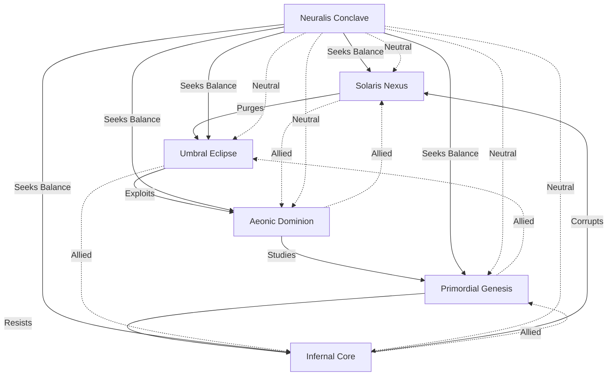

# Merged Faction System

## Core Factions

### 1. Solaris Nexus

**Theme**: Cybernetic Order (Solaris + Cyber Nexus)  
**Visual**: Golden-white armor with glowing circuits, holographic halos  
**Playstyle**: Defensive control with calculated counterattacks

**Signature Actions**:

1. **Divine Algorithm** (3 Energy) - Predict and counter opponent's next move
2. **Radiant Firewall** (4 Energy) - Create barriers that reflect damage
3. **Quantum Blessing** (2 Energy) - Enhance ally's next action
4. **System Purge** (5 Energy) - Remove all debuffs and gain immunity
5. **Halo Protocol** (3 Energy) - Grant shield to all allies
6. **Neural Override** (6 Energy) - Take control of enemy unit for 1 turn

**Synergy Bonus**: For every 2 Solaris Nexus cards in play, gain +1 Energy regeneration

---

### 2. Umbral Eclipse

**Theme**: Shadow Tech (Umbra + Obsidian Eclipse)  
**Visual**: Purple-black digital mist, data streams, glitching shadows  
**Playstyle**: Disruption and information warfare

**Signature Actions**:

1. **Void Protocol** (3 Energy) - Disable enemy abilities
2. **Data Phantom** (2 Energy) - Create digital clones
3. **Shadow Meld** (4 Energy) - Become untargetable for 1 turn
4. **Glitch Strike** (3 Energy) - Deal damage and apply random debuff
5. **Dark Harvest** (5 Energy) - Steal health from all enemies
6. **Neural Parasite** (4 Energy) - Copy enemy ability

**Synergy Bonus**: Enemies pay +1 Energy for abilities in lanes with Umbral Eclipse units

---

### 3. Aeonic Dominion

**Theme**: Time Architects (Aeonic + Astral Dominion)  
**Visual**: Fractal time crystals, floating hourglasses, cosmic energy  
**Playstyle**: Temporal manipulation and board control

**Signature Actions**:

1. **Chrono Rift** (4 Energy) - Rewind opponent's last action
2. **Quantum Paradox** (6 Energy) - Create alternate timeline
3. **Time Dilation** (3 Energy) - Slow all enemies
4. **Precognition** (2 Energy) See opponent's hand
5. **Temporal Shield** (5 Energy) - Prevent all damage for 1 turn
6. **Reality Fracture** (7 Energy) - Reshuffle all units

**Synergy Bonus**: Reduce ability costs by 1 (minimum 1) for each different Aeonic Dominion card played this turn (max 3 reduction per turn)

---

### 4. Primordial Genesis

**Theme**: Bio-Titans (Verdant + Titanborn)  
**Visual**: Living armor, organic-mechanical fusion, crystalline growths  
**Playstyle**: Ramp and overwhelming force

**Signature Actions**:

1. **Gaia's Wrath** (5 Energy) - Massive area attack
2. **Adaptive Carapace** (3 Energy) - Gain resistance to last damage type
3. **Titanic Growth** (4 Energy) - Permanently increase stats
4. **Root Network** (3 Energy) - Heal all allies
5. **Stoneform** (2 Energy) - Become immune but can't attack
6. **Primal Surge** (6 Energy) - Transform all units into random creatures

**Synergy Bonus**: Gain +1/+1 for each Primordial Genesis card in play

---

### 5. Infernal Core

**Theme**: Techno-Demons (Infernal + Primordial elements)  
**Visual**: Molten circuits, hellfire energy, infernal machinery  
**Playstyle**: High risk/reward aggression

**Signature Actions**:

1. **Hellfire Overclock** (3 Energy) - Boost power at cost of HP
2. **Soulfire Protocol** (4 Energy) - Sacrifice units for massive damage
3. **Infernal Contract** (2 Energy) - Draw cards, take damage
4. **Chaos Engine** (5 Energy) - Random effects each turn
5. **Nova Pulse** (6 Energy) - Damage all enemies and structures
6. **Demonic Possession** (4 Energy) - Take control of enemy unit (lose it after turn)

**Synergy Bonus**: Gain +1 Attack for each 5 HP missing

---

### 6. Neuralis Conclave

**Theme**: Mind Over Matter (Neurosynth + Arcane Covenant)  
**Visual**: Floating neural networks, glowing brain patterns, psionic energy  
**Playstyle**: Control and manipulation through psychic dominance

**Signature Actions**:

1. **Psionic Storm** (4 Energy) - Damage all enemies based on hand size
2. **Mind Meld** (3 Energy) - Copy opponent's last played action
3. **Cerebral Overload** (5 Energy) - Force opponent to discard 2 cards
4. **Neural Uplink** (2 Energy) - Draw a card, reduce its cost by 1
5. **Psychic Barrier** (3 Energy) - Negate next source of damage
6. **Collective Unconscious** (6 Energy) - Play the top 3 cards of your deck

**Synergy Bonus**: Gain +1 card draw when playing 2+ actions in a turn

## Faction Relationships

## Deck Building Rules

- 40-card minimum deck size
- Maximum 3 copies of any non-hero card
- Must include at least 15 cards from your hero's faction
- Maximum of 2 factions per deck (including hero faction)
- Each deck must include at least 10 action cards
- Maximum of 1 Legendary card per deck

## Energy System

- Start with 1 Energy crystal (max 10)
- Gain 1 Energy crystal at start of turn (up to max)
- Some cards can generate additional Energy
- Different factions have different Energy generation capabilities

## Ascension System

Heroes can ascend through:

1. **Technological Path** - Gain cybernetic augmentations
2. **Mystical Path** - Unlock ancient magical powers
3. **Hybrid Path** - Combine both for unique abilities

Each path offers different bonuses and changes how your hero plays.
