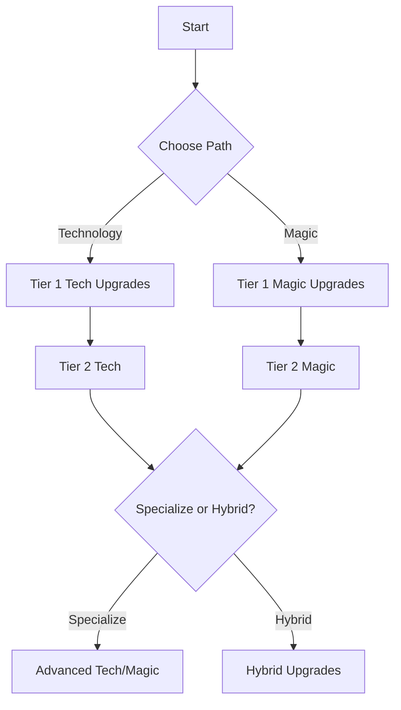

# Tech/Magic Upgrade System

## Core Principles

The upgrade system allows players to customize their heroes and units through two parallel advancement paths: Technological Augmentations and Mystical Enchantments. Players can specialize in one path or create hybrid builds.

## Upgrade Tiers

### Tier 1 (Levels 1-5)

- Basic upgrades that define your initial playstyle
- Unlocks at match start
- Low resource cost

### Tier 2 (Levels 6-10)

- Intermediate upgrades that enhance your chosen path
- Unlocks after reaching level 5
- Moderate resource cost

### Tier 3 (Levels 11-15)

- Advanced upgrades with powerful effects
- Unlocks after reaching level 10
- High resource cost

## Technological Path

### Augmentation Slots

1. **Neural Interface** - Improves ability usage
2. **Cybernetic Core** - Enhances stats and regeneration
3. **Weapon Systems** - Boosts attack capabilities
4. **Defense Matrix** - Improves damage mitigation
5. **Utility Modules** - Provides special abilities

### Signature Upgrades

- **Overclock Systems**: +2 Energy regen, but take 1 damage per turn
- **Nanite Swarm**: Heal 2 HP at start of turn
- **Plasma Shield**: Gain 5 temporary HP at start of combat
- **Targeting Computer**: +1 to all attacks
- **Stealth Field**: Become untargetable for 1 turn (3 turn cooldown)

## Mystical Path

### Enchantment Slots

1. **Arcane Focus** - Enhances magical abilities
2. **Spiritual Bond** - Improves healing and buffs
3. **Elemental Affinity** - Boosts elemental damage
4. **Ethereal Form** - Provides damage avoidance
5. **Ancient Knowledge** - Reduces ability costs

### Signature Upgrades

- **Arcane Mastery**: -1 to all ability costs
- **Spirit Link**: Heal for 25% of damage dealt
- **Elemental Fury**: +2 to all elemental damage
- **Ethereal Step**: Can move through units
- **Ancient Power**: +1 to all stats per 5 levels

## Hybrid Path

### Synergy Upgrades

Available when mixing Tech and Magic upgrades:

1. **Arcane Circuitry** (2 Tech + 1 Magic)
   - Convert 1 Energy to 2 Mana per turn

2. **Technomancer's Gambit** (1 Tech + 2 Magic)
   - Spells have a 25% chance to not consume Mana

3. **Soulforged Steel** (3 Tech + 3 Magic)
   - Armor also provides magic resistance

4. **Reality Hacker** (4 Tech + 2 Magic)
   - Can modify opponent's abilities once per game

## Upgrade Resources

1. **Tech Scrap**
   - Gained from destroying mechanical units
   - Used for technological upgrades

2. **Arcane Essence**
   - Gained from defeating magical beings
   - Used for mystical upgrades

3. **Quantum Cores**
   - Rare resource from objectives
   - Used for hybrid upgrades

## Progression System

## Balance Considerations

1. **Early Game**
   - Tech provides immediate, reliable benefits
   - Magic has stronger scaling potential

2. **Mid Game**
   - Hybrid builds become viable
   - Specialization starts to show strengths

3. **Late Game**
   - Pure builds have stronger top-end upgrades
   - Hybrid builds offer more flexibility

## Visual Indicators

- **Tech Upgrades**: Blue circuit patterns
- **Magic Upgrades**: Purple arcane symbols
- **Hybrid Upgrades**: Blue-purple fusion effects
- **Active Buffs**: Small icons above unit
- **Passive Effects**: Subtle aura/particle effects
