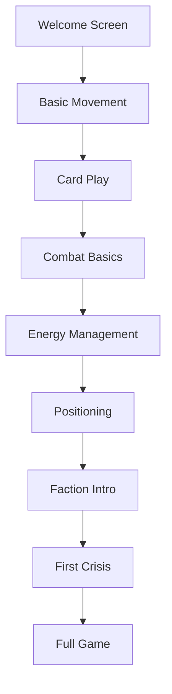

# Tutorial & Onboarding Design

## Learning Objectives

1. Teach core mechanics effectively
2. Introduce complexity gradually
3. Encourage strategic thinking
4. Minimize information overload

## Phased Learning Path

### Phase 1: Basic Controls (5-7 minutes)

**Focus**: Core interaction

- Card play mechanics
- Grid movement
- Basic combat resolution

### Phase 2: Core Systems (10-12 minutes)

**Focus**: Core game loops

- Energy management
- Card synergies
- Positioning basics

### Phase 3: Advanced Tactics (15-20 minutes)

**Focus**: Strategic depth

- Faction mechanics
- Advanced positioning
- Crisis events

## Tutorial Structure

### Interactive Lessons

### Scenario-Based Learning

1. **Defense Scenario**

   - Protect an objective
   - Teaches unit placement and zone control

2. **Race Scenario**

   - Reach a point first
   - Teaches movement and initiative

3. **Puzzle Scenario**

   - Win in one turn
   - Teaches card combos and sequencing

## Visual Design

### Tutorial UI Elements

- **Coach Character**: Faction-themed guide
- **Step Indicators**: Progress through lessons
- **Interactive Elements**: Highlighted when relevant
- **Tooltips**: Context-sensitive help

### Feedback Systems

- **Positive Reinforcement**: Visual/audio cues for correct actions
- **Gentle Correction**: Hints for mistakes
- **Progressive Hints**: Additional help if player struggles

## Accessibility Features

### Learning Support

- Replayable tutorials
- Optional voice-over
- Text-to-speech support
- Closed captions

### Difficulty Adjustment

- Optional advanced tips
- Skip options for experienced players
- Challenge modes for practice

## Implementation Roadmap

### Phase 1: Core Tutorial (Weeks 1-2)

- [ ] Basic movement and card play
- [ ] Combat introduction
- [ ] Energy management

### Phase 2: Intermediate (Weeks 3-4)

- [ ] Positioning scenarios
- [ ] Faction mechanics
- [ ] First crisis event

### Phase 3: Advanced (Weeks 5-6)

- [ ] Full game simulation
- [ ] Challenge scenarios
- [ ] AI coach behaviors

## Evaluation Metrics

### Completion Rates

- Tutorial start to finish
- Individual lesson completion
- Drop-off points

### Learning Outcomes

- Pre/post tutorial knowledge check
- In-game performance metrics
- Player confidence surveys

### Player Feedback

- In-tutorial ratings
- Optional feedback prompts
- Post-tutorial survey

---
*Document Version: 1.0.0*  
*Last Updated: 2025-07-31*
