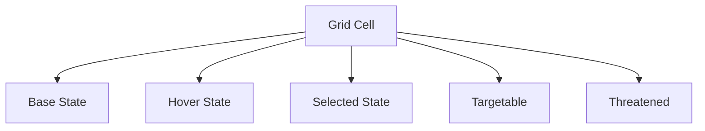

# UI/UX Improvements

## Core Principles

1. **Clarity**: Immediate understanding of game state
2. **Feedback**: Clear responses to player actions
3. **Efficiency**: Minimize clicks, maximize information
4. **Accessibility**: Support for various player needs

## Battlefield Enhancements

### Grid Visualization

- **Base State**: Subtle border, terrain type indicator
- **Hover State**: Gentle glow, movement/range preview
- **Selected**: Highlighted border, ability ranges
- **Targetable**: Pulsing outline, color-coded by action
- **Threatened**: Red tint for enemy attack ranges

### Card Interface

#### Hand Area

- Dynamic scaling based on hand size
- Clear highlight for playable cards
- Energy cost prominently displayed
- Hover: Enlarged preview, full card text

#### Play Zones

- Clear lane indicators (Front/Middle/Back)
- Visual distinction between friendly/enemy zones
- Drop preview for card placement

## Information Hierarchy

### Priority Levels

1. **Critical**: Turn timer, health totals, win conditions
2. **High**: Active effects, unit statuses
3. **Medium**: Card details, ability descriptions
4. **Low**: Flavor text, cosmetic elements

### Visual Indicators

- **Status Effects**: Persistent icons with duration counters
- **Card States**: Playable/Unplayable, Enhanced, Silenced
- **Synergy Bonuses**: Subtle glow when conditions are met

## Accessibility Features

### Text & Readability

- Adjustable font sizes
- High contrast mode
- Customizable text backgrounds

### Visual Aids

- Colorblind-friendly palettes
- Optional grid coordinates
- Visual cues for audio information

## Mobile Considerations

### Touch Targets

- Minimum 48x48px for all interactive elements
- Spaced controls to prevent mis-taps
- Right/left hand mode options

### Layout Adaptation

- Dynamic UI scaling
- Context-sensitive controls
- Gesture support with visual feedback

## Implementation Priorities

### Phase 1: Core Gameplay (MVP)

- [ ] Grid visualization system
- [ ] Card play feedback
- [ ] Basic status indicators

### Phase 2: Quality of Life

- [ ] Customizable UI elements
- [ ] Advanced tooltips
- [ ] Performance optimization

### Phase 3: Polish

- [ ] Animated transitions
- [ ] Advanced visual effects
- [ ] Full accessibility suite

---
*Document Version: 1.0.0*  
*Last Updated: 2025-07-31*
