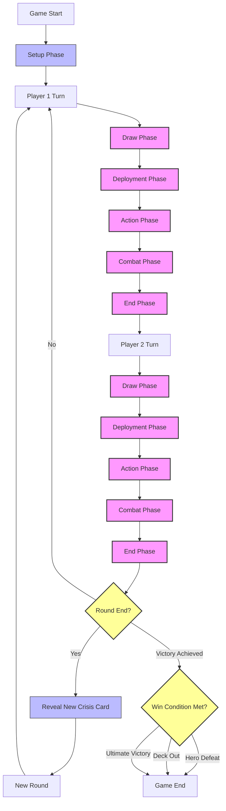
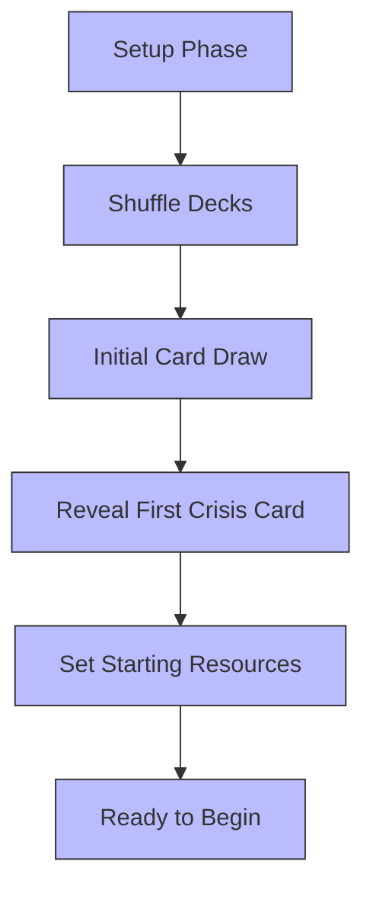
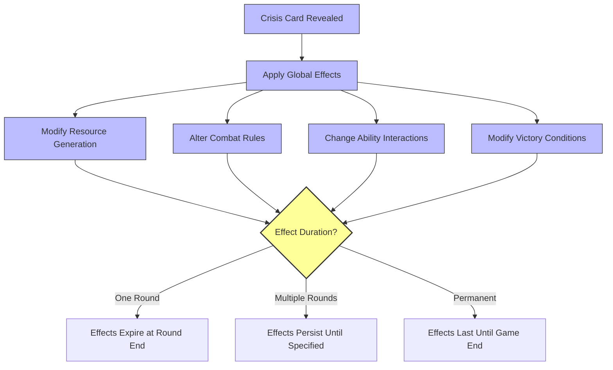
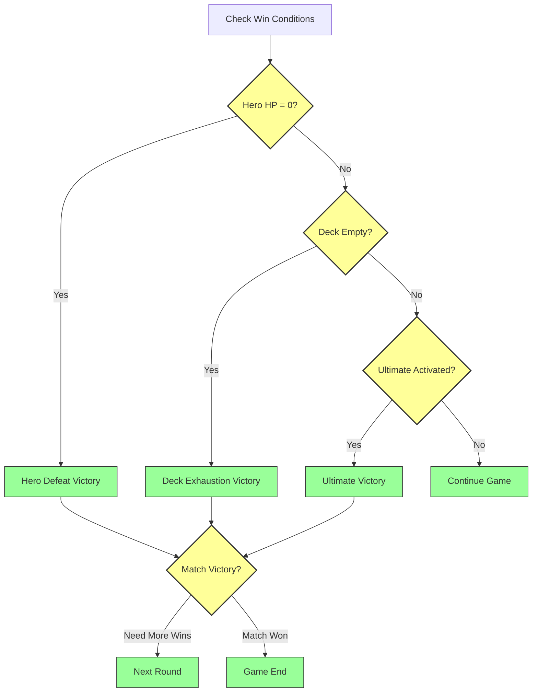
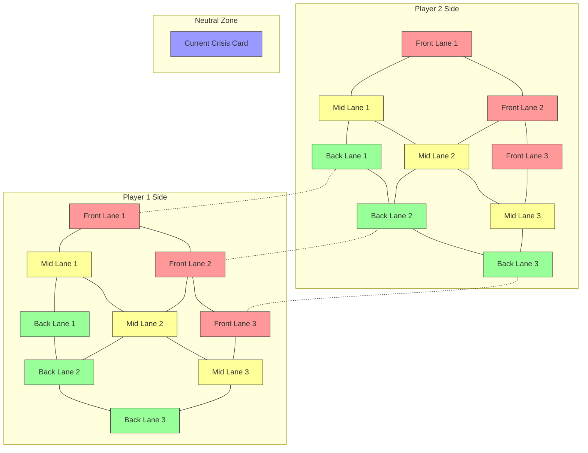
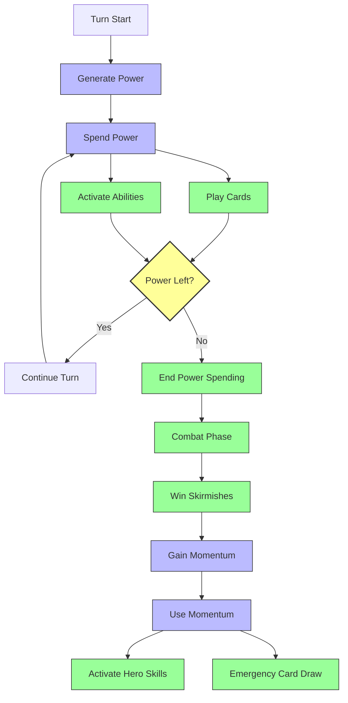

# Crisis Unleashed - Game Flow Diagram

This document provides a visual representation of the game flow in Crisis Unleashed, showing the turn structure, player actions, and how Crisis cards influence gameplay.

## Core Game Flow



## Detailed Phase Breakdown

### Setup Phase



### Player Turn Phases

```mermaid
flowchart TD
    begin[Turn Begins] --> drawPhase[Draw Phase]
    
    %% Draw Phase
    drawPhase --> drawChar[Draw Character Card]
    drawChar --> drawAction[Draw Action Card]
    drawAction --> applyEffects1[Apply Draw Effects]
    
    %% Deployment Phase
    applyEffects1 --> deployPhase[Deployment Phase]
    deployPhase --> spendPower[Spend Power]
    spendPower --> placeUnits[Place Units in Lanes]
    placeUnits --> positioning[Optimize Positioning]
    
    %% Action Phase
    positioning --> actionPhase[Action Phase]
    actionPhase --> playAction[Play Action Cards]
    playAction --> activate[Activate Abilities]
    activate --> resolveActions[Resolve Effects]
    
    %% Combat Phase
    resolveActions --> combatPhase[Combat Phase]
    combatPhase --> declareAttacks[Declare Attacks]
    declareAttacks --> resolveSkirmishes[Resolve Lane Battles]
    resolveSkirmishes --> calculateDamage[Calculate Damage]
    calculateDamage --> applyEffects2[Apply Combat Effects]
    
    %% End Phase
    applyEffects2 --> endPhase[End Phase]
    endPhase --> momentum[Tally Momentum]
    momentum --> resetPower[Reset Unused Power]
    resetPower --> cleanup[End of Turn Effects]
    cleanup --> end[Turn Ends]
    
    classDef phase fill:#f9f,stroke:#333,stroke-width:2px
    classDef action fill:#bbf,stroke:#333,stroke-width:1px
    
    class drawPhase,deployPhase,actionPhase,combatPhase,endPhase phase
    class drawChar,drawAction,applyEffects1,spendPower,placeUnits,positioning,playAction,activate,resolveActions,declareAttacks,resolveSkirmishes,calculateDamage,applyEffects2,momentum,resetPower,cleanup action
```

### Crisis Card Influence



## Win Condition Flowchart



## Battlefield Layout and Movement



## Resource Management



## How to Use This Document

These diagrams can be integrated into your documentation in several ways:

1. **Include in the Game Rules documentation** to provide visual explanations of turn structure
2. **Reference in Tutorial Design** to help new players understand game flow
3. **Use in Digital Implementation** to guide UI development
4. **Include in Quick Start Guide** for new players

The diagrams use Mermaid.js syntax, which is compatible with GitHub Markdown and many documentation platforms. To render these diagrams:

- In GitHub: The diagrams will render automatically in GitHub markdown
- In documentation sites: Ensure Mermaid.js support is enabled
- For print: Export the rendered diagrams as images

## Implementation Notes

To ensure these diagrams stay current with game rules:

1. Update this document whenever turn structure or crisis card mechanics change
2. Ensure all referenced mechanics match the current rule definitions
3. Consider creating specialized diagrams for complex interactions

---

*Last Updated: 2025-08-01*
