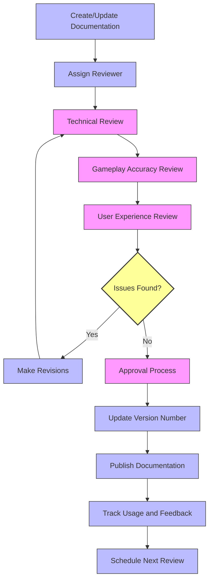
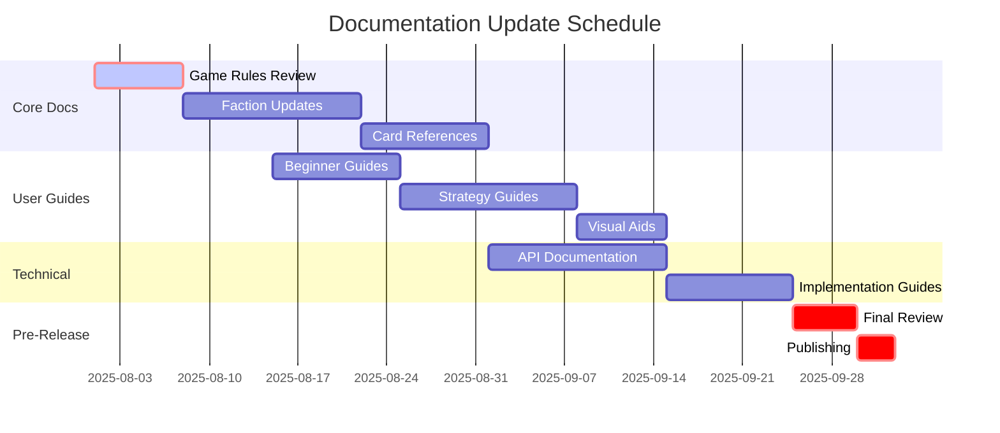
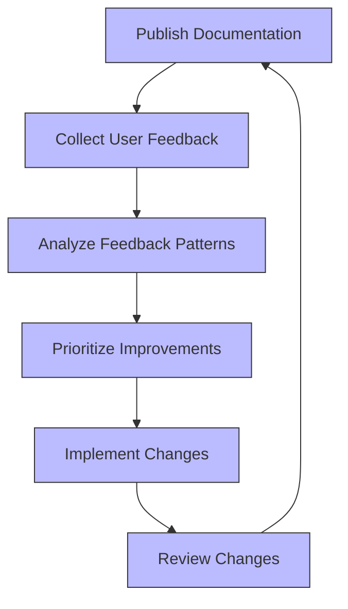

# Documentation Review Workflow

This document outlines the process for reviewing, updating, and maintaining the Crisis Unleashed documentation.

## Review Workflow

## Review Types

### 1. Technical Review

- **Focus**: Technical accuracy, code references, implementation details
- **Reviewer**: Game developer or technical team member
- **Key Questions**:
  - Are all technical details accurate and current?
  - Do API references match the actual implementation?
  - Are file paths and code samples correct?

### 2. Gameplay Accuracy Review

- **Focus**: Game rules, mechanics, and strategic content
- **Reviewer**: Game designer or balance team member
- **Key Questions**:
  - Do documented rules match the actual game?
  - Are card interactions described accurately?
  - Is strategic guidance sound and helpful?

### 3. User Experience Review

- **Focus**: Readability, clarity, and user-friendliness
- **Reviewer**: Community manager, content writer, or external tester
- **Key Questions**:
  - Is the document easy to understand for the intended audience?
  - Is navigation intuitive?
  - Does the document answer likely user questions?

## Approval Process

1. **Initial Approval**: Document creator or editor signs off on changes
2. **Technical Approval**: Technical reviewer confirms accuracy
3. **Final Approval**: Product owner or documentation lead gives final approval
4. **Release Documentation**: Documentation is published to relevant channels

## Version Control

### Version Numbering

Documentation uses a three-part version number: `MAJOR.MINOR.PATCH`

- **MAJOR**: Increment for complete rewrites or structural changes
- **MINOR**: Increment for significant content additions or changes
- **PATCH**: Increment for small corrections or clarifications

Example: `Documentation v2.3.5`

### Version Tracking

Every document should include:

- Current version number
- Last updated date
- Change log or summary of recent changes

## Review Frequency

| Document Type | Review Frequency | Update Triggers |
|---------------|-----------------|-----------------|
| Core Rules | Monthly | Game patches, balance changes |
| Faction Documentation | Quarterly | New cards, balance changes |
| Starter Guides | Quarterly | New player feedback |
| Technical Documentation | After major releases | API changes, feature additions |
| Release Notes | Each game update | New features, bug fixes |

## Documentation Update Schedule

## Documentation Feedback Loop

## Feedback Collection Methods

1. **Direct User Surveys**

   - Sent to players after using documentation
   - Focus on clarity, completeness, and usability

2. **Documentation Usage Analytics**

   - Track most/least viewed pages
   - Analyze search queries and navigation paths

3. **Community Feedback Channels**

   - Forum threads dedicated to documentation feedback
   - Discord channel for real-time input

4. **Support Ticket Analysis**

   - Identify common questions that should be addressed in documentation
   - Track issues related to unclear documentation

## Review Team Roles and Responsibilities

### Documentation Lead

- Oversees entire documentation ecosystem
- Approves major structural changes
- Sets documentation priorities and schedules

### Content Creators

- Write new documentation
- Update existing content
- Implement feedback-based improvements

### Technical Reviewers

- Verify technical accuracy
- Test code samples and examples
- Ensure alignment with current implementation

### User Experience Reviewers

- Evaluate clarity and readability
- Test navigation and information architecture
- Provide perspective of target audience

## Documentation Review Checklist

### Content Quality

- [ ] All information is accurate and current
- [ ] Grammar and spelling are correct
- [ ] Terminology is consistent with game terms
- [ ] Examples are clear and relevant

### Structure

- [ ] Document follows standard template
- [ ] Headings and sections are logically organized
- [ ] Table of contents is complete and accurate
- [ ] Cross-references are working correctly

### Visual Elements

- [ ] Diagrams accurately represent concepts
- [ ] Images are clear and properly labeled
- [ ] Visual aids enhance rather than distract
- [ ] Color schemes follow accessibility guidelines

### Technical

- [ ] Code samples work as described
- [ ] API references match current implementation
- [ ] File paths and references are correct
- [ ] Links to other documents are valid

### User Experience

- [ ] Document answers likely user questions
- [ ] Navigation is intuitive
- [ ] Information hierarchy makes sense
- [ ] Instructions can be followed without confusion

## Implementation

This workflow will be implemented immediately for all new documentation and retroactively applied to existing documentation according to the following schedule:

1. Core game mechanics documentation: Review by August 15, 2025
2. Faction and card documentation: Review by September 1, 2025
3. Starter guides and tutorials: Review by September 15, 2025
4. Technical and implementation guides: Review by October 1, 2025

---

*Last Updated: 2025-08-01*  
*Version: 1.0.0*
